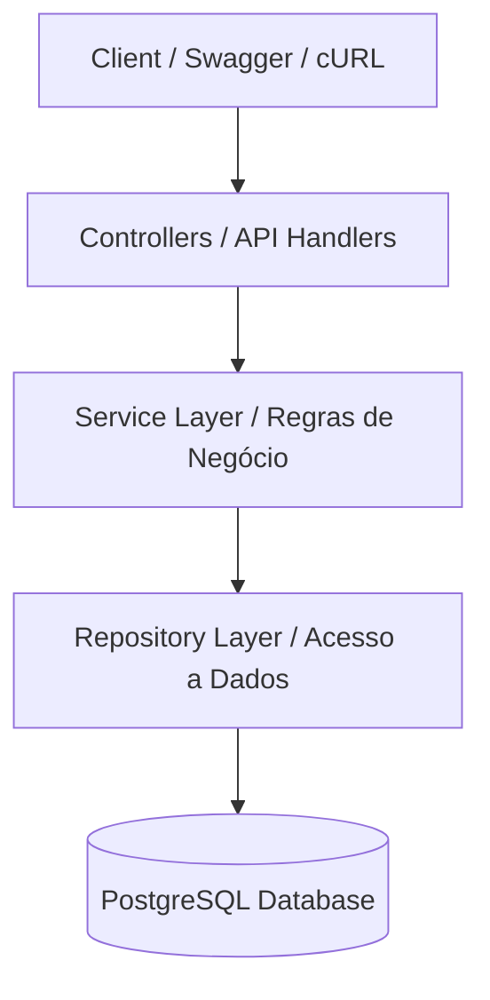

# SOA-CP5

## Grupo

|Nome|RM|
|:-:|:-:|
|Diogo Julio|553837|
|Jonata Rafael|552939|
|Matheus Zottis|94119|
|Victor Didoff|552965|
|Vinicius da Silva|553240|

## Requisitos

|Software|Versão|Tipo|
|:-:|:-:|:-:|
|Docker|20+|Docker|
|Docker Compose|1.29+|Docker|
|Golang|1.25+|Local|
|Postgres|17+|Local|
|Swag CLI|1.16+|Local|

## Execução

Você precisará do Docker e docker-compose instalados na sua máquina.

1. Na raiz do projeto, execute:
```bash
docker-compose up --build
```
Isso subirá o banco de dados e a API, rodando as migrações automaticamente.

## Swagger

A documentação do Swagger pode ser acessada através de:
`http://localhost:8080/swagger/index.html`

## Exemplos de cURL

### 1. Criar um Hóspede
```bash
curl -X POST http://localhost:8080/api/v1/guests \
  -H "Content-Type: application/json" \
  -d '{
    "full_name": "Maria Oliveira",
    "document": "98765432100",
    "email": "maria@example.com",
    "phone": "11988888888"
}'
```

### 2. Criar um Quarto
```bash
curl -X POST http://localhost:8080/api/v1/rooms \
  -H "Content-Type: application/json" \
  -d '{
    "number": "202",
    "type": "DELUXE",
    "capacity": 4,
    "price_per_night": 300.00
}'
```

### 3. Criar uma Reserva

```bash
curl -X POST http://localhost:8080/api/v1/reservations \
  -H "Content-Type: application/json" \
  -d '{
    "guest_id": "g1-uuid-placeholder",
    "room_id": "r1-uuid-placeholder",
    "checkin_expected": "2026-06-01T14:00:00Z",
    "checkout_expected": "2026-06-05T12:00:00Z",
    "guests_count": 2
}'
```

### 4. Transições de Status da Reserva (Check-in, Check-out, Cancelar)

As alterações de status da reserva agora seguem o padrão RESTful usando `PATCH`. Substitua `{id}` pelo ID da reserva retornado.

**Fazer Check-in (Deve ser feito até 3h antes da data prevista):**
```bash
curl -X PATCH http://localhost:8080/api/v1/reservations/{id}/status \
  -H "Content-Type: application/json" \
  -d '{"status": "CHECKED_IN"}'
```

**Fazer Check-out:**
```bash
curl -X PATCH http://localhost:8080/api/v1/reservations/{id}/status \
  -H "Content-Type: application/json" \
  -d '{"status": "CHECKED_OUT"}'
```

**Cancelar Reserva:**
```bash
curl -X PATCH http://localhost:8080/api/v1/reservations/{id}/status \
  -H "Content-Type: application/json" \
  -d '{"status": "CANCELED"}'
```

## Arquitetura

### Diagrama de Camadas

A aplicação segue uma arquitetura em camadas, separando as responsabilidades de roteamento HTTP, lógica de negócio e persistência de dados.



### Architecture Decision Records (ADRs)

#### ADR 1: Transição de Status RESTful para Reservas
* **Contexto:** Ações de mudança de estado para reservas (check-in, check-out, cancelamento) costumam ser modeladas como endpoints imperativos (ex: `POST /checkin`).
* **Decisão:** Consolidar todas as transições de estado através de atualizações parciais de recursos usando `PATCH /api/v1/reservations/{id}/status` com payload JSON contendo o novo estado.
* **Consequências:** A API torna-se mais aderente ao padrão RESTful (foco no estado do recurso). A documentação simplifica-se e a validação de ciclo de vida da reserva fica centralizada e consistente.

#### ADR 2: Arquitetura em Camadas (Separation of Concerns)
* **Contexto:** Sistemas com regras de negócio complexas, como o limite de horas de antecedência para check-in, necessitam de código limpo e testável, sem acoplamento direto com persistência ou frameworks web.
* **Decisão:** Adotar as camadas `Controller/Handler` para validação de payload/HTTP, `Service` para isolamento de regras de negócio (core logic), e `Repository` para abstração e interação com o banco de dados.
* **Consequências:** Maior testabilidade via injeção de dependência na camada Service, permitindo mockar os repositórios. O sistema ganha modularidade, facilitando futuras manutenções e evolução tecnológica.
